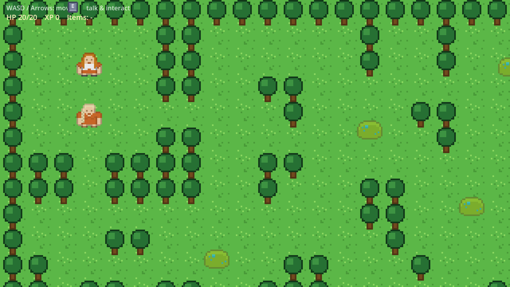
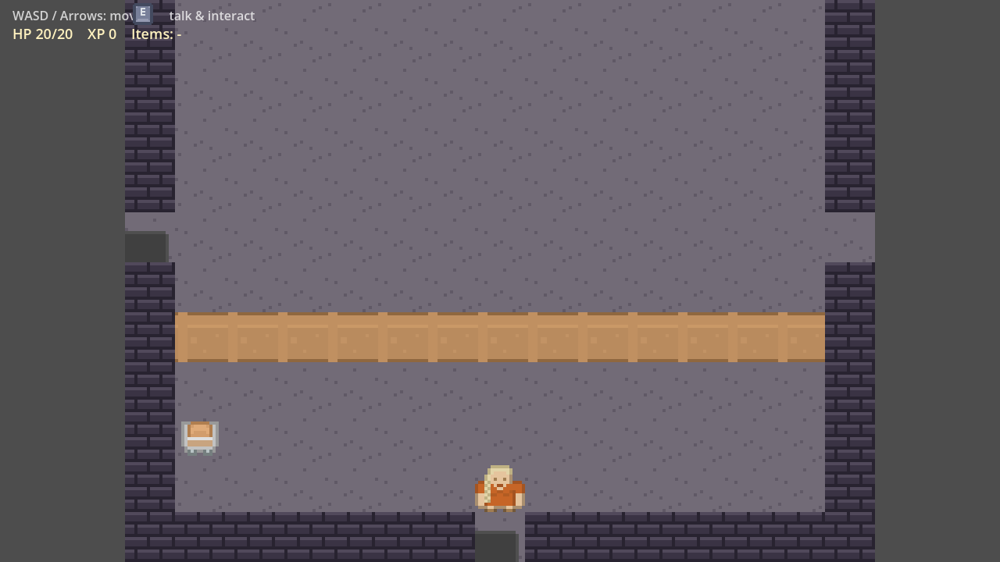
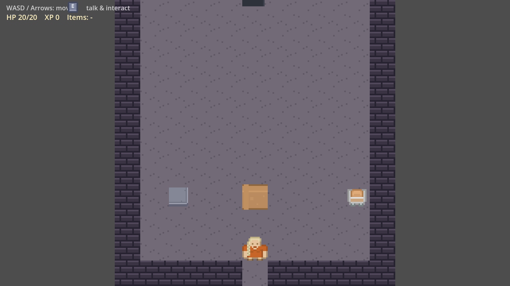
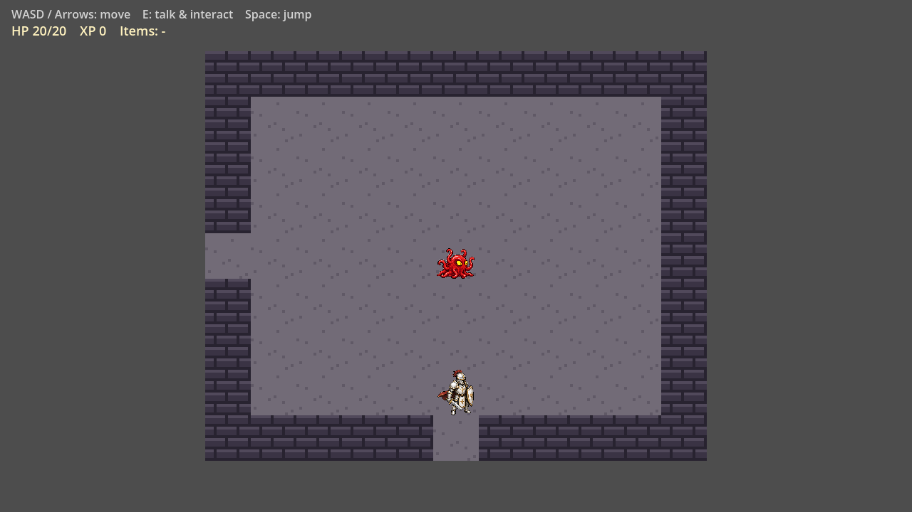
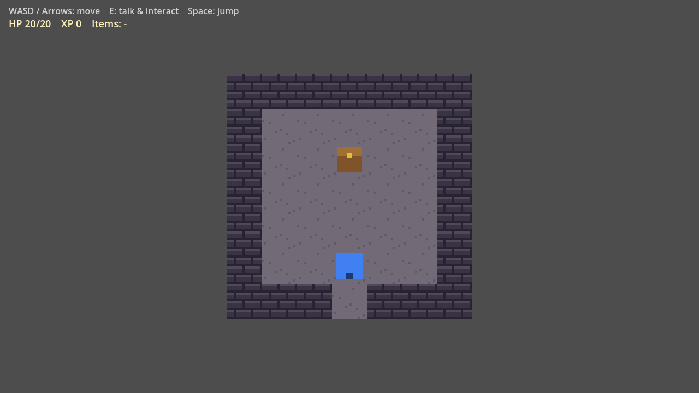

# Dungeon Friends

> Generated from LLM Workbench v2.1. See `RUNBOOK.md` -> Upgrading The
> Harness.

A 2D top-down adventure RPG - **Zelda meets BG3**. Explore a hand-built fantasy
world Zelda-style (dungeons, puzzles, key items), recruit a party of "Dungeon
Friends," and fight BG3-style turn-based tactical battles on a zoomed-in grid.
Retro-pixel-art inspired, rendered natively at flexible HD/ultrawide resolutions
rather than a locked handheld-style canvas.

A solo, AI-assisted Godot 4.7 project: grid-based overworld and dungeon
exploration (Zelda-style block/switch/key puzzles), BG3-style turn-based
*tactical* party combat (a dedicated battle mode: select a unit, move it within
its highlighted range, act), and recruitable "Dungeon Friends" party
members. The world starts in a fantasy forest and later expands into a castle
city, mountains, and rivers. Current state: a playable slice on placeholder
art - walk an LDtk-authored forest, talk to NPCs, bump a visible enemy into a
tactical d10 battle on terrain copied from the contact area, control Hero plus
a temporary test companion with interleaved initiative and highlighted
movement/attack ranges, win the boss's key, and enter the Phase 2 four-room
tutorial dungeon: find the one loose brick in the wall, step on and off a
floor pressure plate to see its gate react, push the heavy block onto that
plate to hold the gate open,
beat the key guardian, loop back,
and unlock the side room holding the shield chest. Phase 3's save/load slice
is built (2026-07-10): save at the crystal by the healer's campfire, a
Continue/New Game prompt on boot, checkpoint respawns on defeat (keep
inventory, lose XP to the level floor - dungeon entrance inside, healer
outside), Zelda-style pit falls, and enemies that respawn whenever a room is
rebuilt. Phase 4 is built through its automated acceptance battery:
regular forest encounters use LDtk-authored two-enemy parties, contact zooms
into combat and back, and a readable turn-order/party-status HUD gives live
feedback. Kayden's windowed balance/feel acceptance remains the final Phase 4
gate. Real art remains a separate phase-timed pass.

## Screenshots

Placeholder-art tour of the current playable slice (captured with
`scenes/dev/screenshot_tour.tscn` - see `RUNBOOK.md` -> Screenshot tour):

| Forest (overworld) | Dungeon hub |
|---|---|
|  |  |

| Pressure-plate room (plate/block/gate) | Fight room (guardian) | Chest room |
|---|---|---|
|  |  |  |

## How This Project Is Run

This repository is governed by a small set of control documents. Read them
before changing anything:

- [`AGENTS.md`](AGENTS.md) - how agents behave here: authority order,
  read/edit scope, the task-selection loop, documentation ownership, and
  proof rules.
- [`BLUEPRINT.md`](BLUEPRINT.md) - what this project is: vision, architecture,
  invariants, and preserved decisions. Stable and source-backed.
- [`TASKBOARD.md`](TASKBOARD.md) - the live work queue and append-only proof
  log. Its **Executive Brief** (top of the file) is the one-glance status for
  anyone who doesn't want to read code.
- [`RUNBOOK.md`](RUNBOOK.md) - how to set up, run, test, build/export, and
  recover this project, plus the verification commands that gate "done".

- [`HARNESS_FEEDBACK.md`](HARNESS_FEEDBACK.md) - the return channel to the
  reusable harness these docs came from.

For the full toolchain and design rationale, see
[`docs/research/audited_research.md`](docs/research/audited_research.md) -
`BLUEPRINT.md` is the canonical design doc; the audit is the "why" behind its
toolchain choices. (The former `docs/planning/Gameplan.md` was retired
2026-07-08 - its content is absorbed into `BLUEPRINT.md`, `RUNBOOK.md`,
`TASKBOARD.md`, and the audit.)

This project was originally adopted into the LLM Workbench harness from an
existing set of planning docs (not bootstrapped from a blank prompt) - see
`docs/LEGACY_HARNESS.md` for the pre-harness `AGENTS.md`/`CLAUDE.md` this
was migrated from.

## Getting Started

```bash
git clone https://github.com/KaydenClark/Dungeon_Friends_Game.git   # install
/Applications/Godot.app/Contents/MacOS/Godot --path game            # run
cd game && /Applications/Godot.app/Contents/MacOS/Godot --headless --path . --import   # test
```

Full setup, environment, and troubleshooting steps live in
[`RUNBOOK.md`](RUNBOOK.md).

## Working With Agents

The control docs are intentionally plain Markdown so they work with Codex,
Claude, or any other agent that reads repository instructions - no framework
or preprocessing required.

For **Claude Code**, `CLAUDE.md` contains `@AGENTS.md` so the rules load
automatically. Other agents should be pointed at `AGENTS.md` as their entry
point.

Every completed agent task leaves proof in its final response and in the
`TASKBOARD.md` proof log. Milestone tasks additionally require a short demo
artifact (screenshot, recording, or one-command demo) so work is accepted on
product truth, not passing checks alone.

## Project Status

See the **Executive Brief** at the top of [`TASKBOARD.md`](TASKBOARD.md) for
the current shipping state, health, any decision the owner needs to make,
blockers, and the next milestone.

## License

No license chosen yet - all rights reserved by default. Add a `LICENSE` file
when Kayden decides on one.
