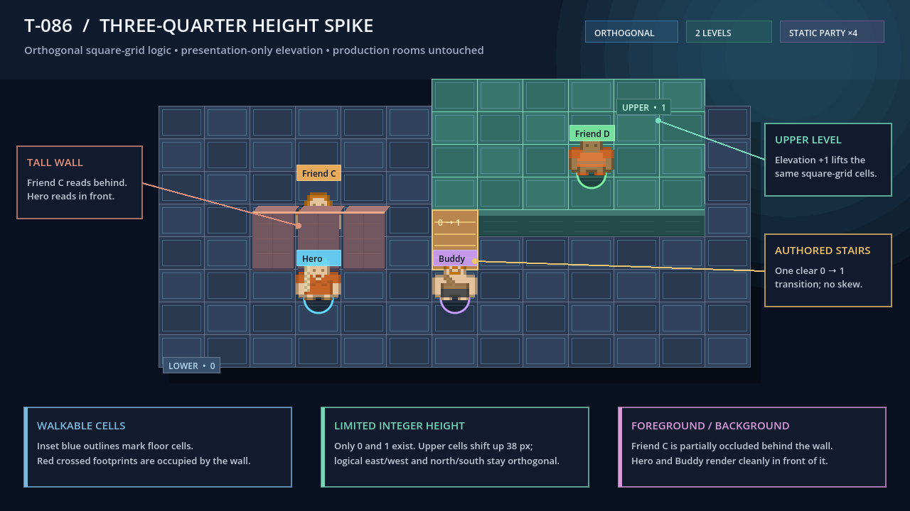
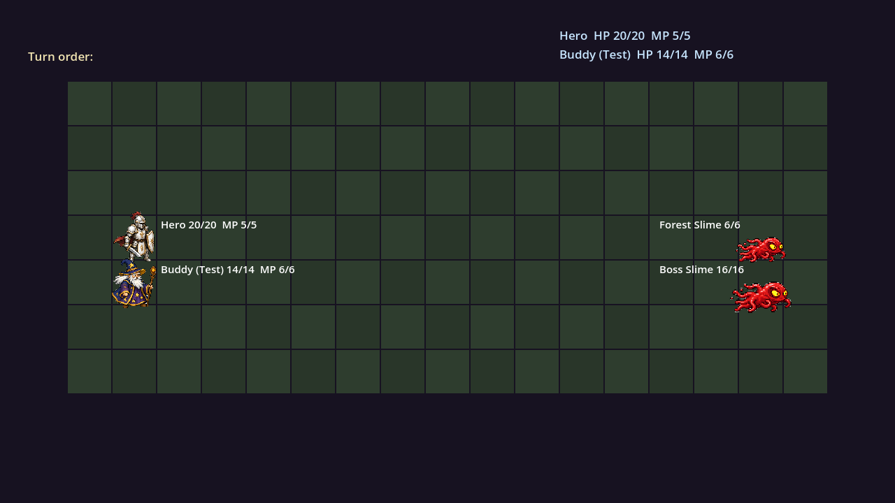
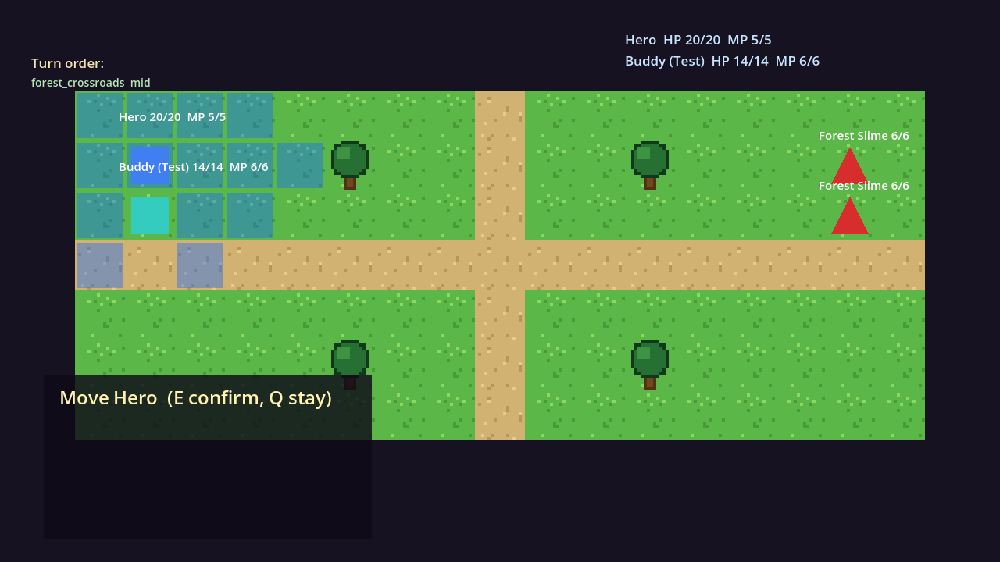

# Dungeon Friends

> Generated from LLM Workbench v2.1. See `RUNBOOK.md` -> Upgrading The
> Harness.

Dungeon Friends is a party-based 2D adventure RPG in active redesign for a
future Steam release.

The goddess Selena has selected you to lead an expedition against the dragon
that has landed atop the mountain overlooking the city. Explore a hand-built
three-quarter-view world, recruit a roster of Dungeon Friends, choose an active
party of four, and combine their abilities to manipulate terrain, solve
puzzles, help people, and win deterministic tactical encounters.

The defining direction is **one world, one vocabulary**:

- the full active party remains visible while exploring;
- combat happens directly where the encounter begins;
- abilities such as Force, Flame, Water, Growth, and Air affect the same
  materials inside and outside combat;
- enemies telegraph their intentions and outcomes are previewable rather than
  resolved through random hit rolls;
- resolved problems stay resolved instead of routinely respawning.

See [`BLUEPRINT.md`](BLUEPRINT.md) for the approved target and
[`TASKBOARD.md`](TASKBOARD.md) for the migration queue.

## Migration Status

The repository currently contains a healthy pre-pivot prototype: an LDtk forest
and tutorial dungeon, grid movement, puzzles, save/load, Kenney CC0 visual
scaffolding, and a separate d10 tactical-combat arena. That build is preserved
as a tested migration baseline while the unified-world replacement is proven
incrementally.

The old executable behavior is **not** the current product target. The first
reversible proof now exists as an isolated three-quarter height/readability
scene; it does not modify or replace the playable production rooms. Migration
continues through the remaining spikes:

1. visible-party exploration without follower softlocks;
2. shared material reactions;
3. same-room deterministic encounters with enemy intents;
4. persistent encounter/world resolution;
5. a short Hero-plus-two-friends thesis slice.

## Unified-World Prototype



This 1280x720 dev-room proof keeps rectangular square-grid logic while adding
two presentation elevations, authored stairs, a tall occluding wall, and four
static party placeholders. The exact review and capture commands are in
[`RUNBOOK.md`](RUNBOOK.md#three-quarter-heightreadability-spike-t-086).

## Baseline Screenshots

These images document the pre-pivot migration baseline and asset seams. They do
not represent the final camera or combat structure.

| Forest | Tutorial dungeon |
|---|---|
|  |  |

| Separate combat baseline | Authored arena baseline |
|---|---|
|  |  |

## Getting Started

```bash
git clone https://github.com/KaydenClark/Dungeon_Friends_Game.git
cd Dungeon_Friends_Game
git switch codex/unified-world-pivot
/Applications/Godot.app/Contents/MacOS/Godot --path game
```

Fast verification:

```bash
cd game
/Applications/Godot.app/Contents/MacOS/Godot --headless --path . --import
/Applications/Godot.app/Contents/MacOS/Godot --headless --path . tests/run_tests.tscn
```

Exact commands, baseline controls, and prototype entry points live in
[`RUNBOOK.md`](RUNBOOK.md).

## Project Control

- [`AGENTS.md`](AGENTS.md): authority, scope, locked pivot decisions, migration
  rules, and verification requirements.
- [`BLUEPRINT.md`](BLUEPRINT.md): canonical product vision and architecture.
- [`TASKBOARD.md`](TASKBOARD.md): active queue, blockers, handoff, and
  append-only proof.
- [`RUNBOOK.md`](RUNBOOK.md): setup, operation, testing, export, and recovery.
- [`docs/WORLD_LORE.md`](docs/WORLD_LORE.md): Selena, the dragon, expedition,
  regions, and Dungeon Friend story development.

The project is built with Godot 4.7 and GDScript. Levels use LDtk and
`TileMapLayer`; game data uses authored resources; verification uses a
first-party headless test harness plus manual/windowed acceptance.

## Release Direction

Steam is the first commercial target, with keyboard and controller support.
Google Play or other mobile distribution is deferred until the PC game and UI
are proven. No Steam page or release date is currently promised.

## License

No repository license has been chosen; all rights are reserved by default.
The license must be decided before public distribution.

Selected prototype art comes from Kenney CC0 packs. Original pack licenses are
preserved under `game/assets/kenney/`; courtesy credit: Kenney,
https://kenney.nl/.
