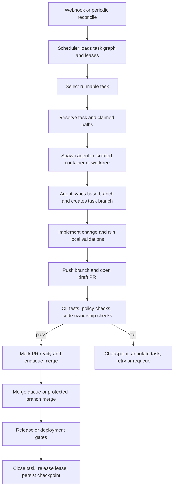
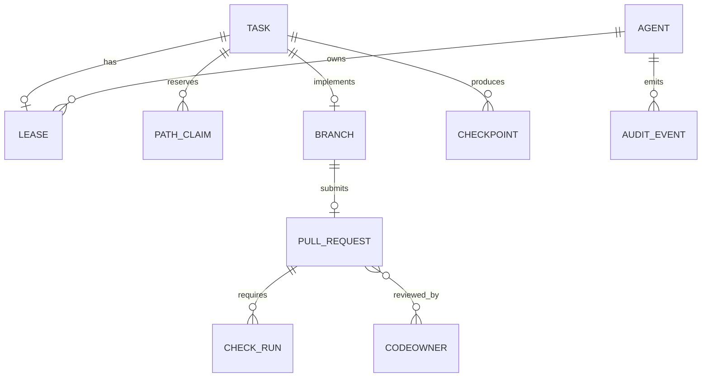

# Designing a Fully Autonomous Multi-Agent Game Development System on GitHub

## Executive summary

A robust autonomous game development system should treat GitHub as the canonical source of code, review state, and release history, but not as the only coordination plane. The safest design is a hybrid: event-driven execution through webhooks and dispatch events, plus a periodic reconciliation loop every X minutes to recover from missed events, stalled workers, and long-running tasks. If you rely on GitHub Actions scheduling alone, the shortest supported interval is every 5 minutes, scheduled runs execute from the default branch, and scheduled runs can be delayed or even dropped during periods of high load, especially around the top of the hour. GitHub itself recommends webhooks over polling, and advises serial rather than concurrent mutating API requests with at least a one-second pause between POST, PATCH, PUT, and DELETE calls. citeturn31view0turn31view1turn18view4turn18view2turn18view3

The most practical coordination pattern for autonomous agents is a centralized scheduler with durable reservations backed by a transactional queue, typically Postgres using `FOR UPDATE SKIP LOCKED`, or a small consensus-backed coordination store such as etcd when you need leader election and lease-based distributed locks. `SKIP LOCKED` is explicitly appropriate for queue-like tables with multiple consumers, but PostgreSQL also warns that it yields an inconsistent view and is therefore not suitable as a general-purpose concurrency model. etcd leases and locks are stronger operational primitives for high availability because lock ownership is tied to a lease and is released automatically when the lease expires. citeturn20view3turn20view4turn20view1turn20view0

To prevent agents from working over one another, use layered controls instead of a single lock. The minimum stack is: task reservation with lease expiry, path-level claims, isolated worktrees or containers per agent, per-task branches, protected base branches, CODEOWNERS-based path ownership, required reviews or policy checks for sensitive paths, merge queues for busy branches, and Git LFS locking for binary or effectively unmergeable assets. GitHub protected branches can require reviews, status checks, signed commits, merge queues, deployments, and can fully lock a branch as read-only. Git LFS locking is specifically designed to block attempts by other users to update a locked path, and verifies on push that locked files were not modified by another actor. citeturn18view7turn18view8turn19view0turn17view3turn19view8

For game development, keep agent task granularity small and idempotent. A task should usually map to one gameplay feature slice, tool change, test repair, asset import batch, or doc update, not “build combat system” or “redo level art.” This mirrors classic task-allocation literature: the Contract Net Protocol uses local negotiation for task distribution, and later task-allocation work frames assignment as an optimization problem based on utility, cost, and changing conditions. Work stealing is excellent for balancing idle workers, but reservations remain necessary to preserve exclusivity over files, assets, or subsystems. citeturn22view0turn22view1turn23view1turn21view2turn21view3

My recommended GitHub branching model is trunk-based with short-lived agent branches, a protected `main`, optional protected `release/*`, and a merge queue for `main` once parallel PR volume is non-trivial. Agent branches should follow a deterministic naming scheme such as `agent/<agent-id>/<task-id>-<slug>`. Binary-heavy or scene-heavy work should additionally claim file paths and, where possible, use LFS locks. CRDTs should be used narrowly, for collaborative docs, manifests, task metadata replicas, or low-semantic-risk structured state, not as the default merge model for core gameplay code or binary assets. CRDTs guarantee convergence without synchronization, but convergence is not the same as semantic correctness. citeturn17view3turn30view0turn19view0turn21view5turn21view6

## Recommended architecture and coordination model

The best default architecture is a hybrid orchestration model with four planes: a coordination plane, an execution plane, a code plane, and an observability plane. The coordination plane holds task state, leases, dependencies, heartbeats, and ownership metadata. The execution plane runs agents in isolated containers or independent Git worktrees. The code plane is GitHub, including branches, PRs, status checks, CODEOWNERS, environments, and audit logs. The observability plane collects traces, metrics, logs, build artifacts, and test evidence. This separation reduces repo churn, lowers API pressure, and keeps high-frequency heartbeats out of Git history while preserving GitHub as the human-review and release boundary. This is a design inference grounded in GitHub’s guidance to avoid polling, avoid concurrent mutating requests, and use workflows, artifacts, and protection rules as control points. citeturn18view4turn18view2turn25view3turn25view1

| Coordination approach | How it works | Strengths | Weaknesses | Best fit |
|---|---|---|---|---|
| Centralized scheduler | One service assigns and leases tasks from a durable queue | Simplest reasoning, best observability, easiest dependency handling | Single scheduler is a control bottleneck unless made highly available | Default choice for most teams |
| Distributed consensus | Multiple schedulers coordinate via replicated log, leader election, distributed locks | Strongest HA semantics, clean lease expiry and failover | Highest operational complexity | Large fleets, strict HA |
| Brokered task queue | Agents pull from queue and acknowledge/reserve work | High throughput and backpressure, good for many homogeneous tasks | Weaker dependency and path-level reasoning unless supplemented | Asset pipelines, test farms |
| Market or negotiation | Agents bid or negotiate for work based on utility | Flexible, adaptive under heterogeneity | Harder to bound behavior and audit | Specialized research systems |

The centralized and distributed rows are directly supported by the literature and systems evidence: Contract Net describes distributed negotiation for task distribution, Raft manages a replicated log under leader-based consensus, and etcd exposes leases, locks, and elections specifically for distributed coordination. PostgreSQL’s `SKIP LOCKED` supports practical queue reservation for centralized schedulers. citeturn22view0turn22view1turn21view4turn20view1turn20view0turn20view3

The default recommendation is a centralized scheduler backed by Postgres, plus a small set of event consumers listening to GitHub webhooks. Use webhooks for PR opened, synchronize, review submitted, check_suite completed, push, release, discussion/issue signals if you encode planning there, and use `repository_dispatch` for external orchestration triggers. Add a periodic reconcile loop every X minutes to scan for expired leases, missing heartbeats, stale draft PRs, blocked tasks, and completed dependencies. Tune X to the cost of a missed event, typical task duration, and your API budget. If you schedule the reconcile loop with GitHub Actions, stay off the top of the hour and treat 5 minutes as the floor, not the default target. citeturn18view5turn31view0turn17view2turn31view2



## Task allocation, locking, and concurrency control

Task allocation should be explicit and utility-based. At minimum, every candidate task should be scored on priority, dependency readiness, estimated duration, path contention, required capabilities, and expected merge risk. That recommendation is consistent with Gerkey and Matarić’s framing of task allocation as an optimization problem over utility, where utility reflects expected quality minus expected resource cost. Work stealing is then useful as a secondary balancing mechanism for idle agents, not as the primary ownership rule. citeturn23view1turn21view2turn21view3

| Allocation method | Use it for | Benefits | Risks |
|---|---|---|---|
| Priority queue | Mainline features, urgent fixes, dependency-aware work | Deterministic and easy to audit | Idle agents may starve on narrow capability tasks |
| Reservation plus lease | Any task that touches code or assets | Strong exclusivity with reclaim on timeout | Needs heartbeat discipline to avoid false expiry |
| Work stealing | Test execution, content processing, low-contention backlog | Good utilization under uneven load | Must not bypass path reservations |
| Negotiation or bidding | Heterogeneous specialist agents | Adapts to capability and cost differences | Harder to debug and verify |

For locking, use a hierarchy. First, reserve the task itself. Second, reserve file or directory globs. Third, require branch isolation. Fourth, use stronger locks for binary assets. Fifth, rely on optimistic merge checks only for low-contention textual changes. This layered model is justified because GitHub branch protection and merge queues control integration, not live file editing, while Git LFS explicitly targets path-level binary locking. citeturn18view7turn17view3turn19view8

| Control | Recommended use | Why |
|---|---|---|
| Task lease | Always | Prevents duplicate execution and supports recovery on timeout |
| Path reservation | Always for code and content | Stops overlapping edits even when tasks differ |
| Git worktree isolation | Always | Multiple worktrees let one repository check out multiple branches independently, reducing local interference | 
| Git LFS locks | Binary scenes, art masters, audio masters, large prefabs or maps | Git LFS locking is designed to block other updates to the locked path and verify locks on push |
| Protected branch lock | `release/*`, `hotfix/*`, frozen milestones | GitHub can make a branch fully read-only |
| Optimistic concurrency | Docs, tests, small textual edits | Lowest friction when contention is rare |
| CRDT replication | Shared task metadata replicas, docs, append-only state | Converges without synchronization, but should not be the mainline code-merge model |

Git supports multiple worktrees per repository, specifically so multiple branches can be checked out at once. GitHub protected branches can be fully locked read-only. Git LFS locking is path-based and enforced during push verification. CRDTs allow updates without synchronization and guarantee convergence, but that property does not guarantee that a merged gameplay state remains semantically valid. citeturn29view0turn19view0turn19view8turn21view5turn21view6

The critical metadata fields should be machine-readable, versioned, and split into durable metadata and live lease state. Durable metadata belongs in the repo or a durable database. Live lease state belongs in the coordination store, with periodic snapshots written back to the repo at milestones rather than every heartbeat.

| Field | Required | Purpose |
|---|---|---|
| `task_id` | Yes | Stable task identity |
| `status` | Yes | `queued`, `ready`, `leased`, `in_progress`, `blocked`, `review`, `merged`, `failed`, `rolled_back` |
| `version` | Yes | Monotonic schema or manifest version |
| `lock_owner` | Yes when leased | Agent or scheduler identity holding the lease |
| `eta` | Yes | Forecast completion time for arbitration and replanning |
| `dependencies` | Yes | Upstream task IDs and dependency type |
| `claimed_paths` | Yes | File globs or directories reserved by this task |
| `base_branch` | Yes | Usually `main` or `release/<train>` |
| `branch_name` | Yes when active | Current working branch |
| `base_commit` | Yes when active | Base SHA for optimistic rebases |
| `lease_expires_at` | Yes when leased | Automatic reclaim point |
| `heartbeat_at` | Yes when leased | Liveness checkpoint |
| `attempt` | Yes | Retry counter |
| `idempotency_key` | Yes | Prevent duplicate side effects |
| `checkpoint_ref` | Recommended | Artifact, tag, or storage key for rollback |
| `required_checks` | Recommended | CI or policy gates |
| `owner_group` | Recommended | Human or agent team responsible for arbitration |
| `last_error` | Recommended | Retry and incident context |

A practical lock template looks like this:

```yaml
schema_version: 1
task_id: TASK-142
status: leased
lock_owner: agent-leveldesign-03
owner_group: world
base_branch: main
branch_name: agent/leveldesign-03/TASK-142-arena-navmesh
base_commit: "8f2a1c4"
claimed_paths:
  - "game/levels/arena/**"
  - "content/navmesh/arena/**"
lease_expires_at: "2026-06-30T18:45:00Z"
heartbeat_at: "2026-06-30T18:40:12Z"
eta: "2026-06-30T19:10:00Z"
dependencies:
  - TASK-137
attempt: 2
idempotency_key: "TASK-142@2@8f2a1c4"
checkpoint_ref: "artifact://builds/TASK-142/checkpoint-02"
required_checks:
  - lint
  - unit
  - integration
  - smoke-playtest
```

For merge conflict automation, enable `rerere` on all agent workers, prefer the default `ort` merge strategy, and use semantic merge drivers where a file format supports deterministic field-wise merges. `rerere` records earlier conflict states and resolutions, then can replay them on later equivalent conflicts. Git explicitly recommends using `--no-rerere-autoupdate` when you want a final sanity check to catch mismerges before staging. citeturn28view1turn28view0turn28view3turn33view0turn33view1

## Recommended GitHub repository design and branching strategy

The repository should make ownership, automation, and content boundaries obvious. A good generic layout is below. It is intentionally explicit about agent state, test layers, and asset boundaries so that CODEOWNERS, path reservations, and policy gates can map cleanly to directories. GitHub CODEOWNERS can live in `.github/`, the repository root, or `docs/`, and review requests are generated from the file on the base branch of the PR. Pull request templates can likewise live in `.github/` and standardize agent-submitted PR bodies. citeturn17view6turn19view1turn32search0turn32search1

```text
repo/
├─ .github/
│  ├─ CODEOWNERS
│  ├─ pull_request_template.md
│  └─ workflows/
│     ├─ agent-reconcile.yml
│     ├─ pr-gate.yml
│     ├─ merge-train.yml
│     └─ release.yml
├─ .agents/
│  ├─ instructions/
│  │  ├─ mission.md
│  │  ├─ coding-standards.md
│  │  ├─ asset-rules.md
│  │  └─ review-policy.md
│  ├─ schemas/
│  │  ├─ task.schema.json
│  │  └─ lock.schema.json
│  ├─ tasks/
│  │  ├─ TASK-137.yaml
│  │  └─ TASK-142.yaml
│  ├─ templates/
│  │  ├─ task.template.yaml
│  │  └─ lock.template.yaml
│  ├─ ownership/
│  │  └─ ownership-map.yaml
│  └─ checkpoints/
│     └─ manifest.json
├─ docs/
│  ├─ architecture/
│  ├─ design/
│  ├─ pipelines/
│  └─ runbooks/
├─ game/
│  ├─ client/
│  ├─ server/
│  ├─ shared/
│  └─ tools/
├─ content/
│  ├─ levels/
│  ├─ characters/
│  ├─ audio/
│  ├─ ui/
│  └─ cinematics/
├─ build/
│  ├─ scripts/
│  ├─ packaging/
│  └─ release/
├─ tests/
│  ├─ unit/
│  ├─ integration/
│  ├─ gameplay/
│  ├─ performance/
│  ├─ smoke/
│  └─ fixtures/
└─ ops/
   ├─ observability/
   ├─ policy/
   └─ secrets/
```

The branching model should be trunk-based with short-lived branches:

| Branch pattern | Purpose | Protection |
|---|---|---|
| `main` | Canonical integration branch | Protected, required checks, required PR, signed commits, merge queue |
| `release/<train>` | Stabilization and production release lines | Protected, read-only during freeze except emergency actors |
| `agent/<agent-id>/<task-id>-<slug>` | Agent working branches | Disposable, auto-deleted after merge |
| `hotfix/<issue-id>-<slug>` | Human or supervised emergency fixes | Protected merge path into `release/*` and back-merge to `main` |
| `spike/<ticket>-<slug>` | Experimental work only | Never deploy directly |

GitHub branch protection supports `fnmatch` branch patterns, including multi-level patterns such as `qa/**/*`, and can require PRs, code-owner review, stale review dismissal, signed commits, merge queues, and branch locks. citeturn30view0turn30view1turn18view7turn18view8turn19view0

A practical convention is:

```text
agent/<agent-id>/<task-id>-<slug>
agent/ai-02/TASK-142-arena-navmesh
agent/tools-01/TASK-233-build-cache-fix
release/2026.07
hotfix/INC-778-crash-on-load
```

The sample agent commit and PR workflow should be deterministic:

1. Agent pulls standing instructions and task manifest.
2. Scheduler grants lease and claimed paths.
3. Agent creates isolated worktree and branch.
4. Agent rebases or refreshes from base SHA.
5. Agent commits in small, self-contained increments.
6. Agent opens a draft PR with required metadata.
7. CI runs. If green and no lease conflict exists, the PR is marked ready.
8. Merge queue serializes integration into `main`.
9. Post-merge workflows update task state and release locks. This sequence is supported by GitHub’s draft PR flow, protected branches, and merge queues. citeturn34search11turn18view7turn17view3

Use a PR title and body template that makes automation trivial:

```text
PR title:
[agent:ai-02] TASK-142 arena-navmesh: rebuild combat arena traversal

Commit message:
agent(ai-02): TASK-142 rebuild arena navmesh

Trailers:
Task-ID: TASK-142
Agent-ID: ai-02
Lease-ID: lease-7b8e
Base-SHA: 8f2a1c4
Idempotency-Key: TASK-142@2@8f2a1c4
```



## CI/CD, testing, checkpoints, and rollback

CI should be split into orchestration workflows and product-validation workflows. Orchestration workflows claim work, open PRs, refresh branches, and update task state. Product-validation workflows run lint, compile, asset import checks, unit tests, integration tests, smoke gameplay tests, performance checks, and packaging. GitHub Actions is a CI/CD platform with workflows defined in `.github/workflows`; workflows can be triggered by repository events, manual dispatch, REST-triggered events, or schedules. Reusable workflows reduce duplication. citeturn31view2turn31view0turn8search0turn8search4

A minimal orchestration workflow can look like this:

```yaml
name: agent-reconcile

on:
  schedule:
    - cron: "7,22,37,52 * * * *"
  workflow_dispatch:
  repository_dispatch:
    types: [agent_reconcile, task_unblocked]

permissions:
  contents: write
  pull-requests: write
  checks: write
  actions: read

concurrency:
  group: agent-reconcile-${{ github.ref }}
  queue: max

jobs:
  reconcile:
    runs-on: ubuntu-latest
    steps:
      - uses: actions/checkout@<pinned-sha>
      - name: Run scheduler
        run: python tools/agents/reconcile.py
```

This example uses three supported trigger modes: schedule, manual dispatch, and `repository_dispatch`; it also serializes runs with a concurrency group. GitHub documents all three trigger modes, and documents workflow concurrency control including queueing behavior. GitHub also recommends pinning third-party actions to full-length commit SHAs. citeturn31view0turn13search8turn18view1turn26view1

The PR gate workflow should enforce branch protection rather than replace it:

```yaml
name: pr-gate

on:
  pull_request:
    types: [opened, synchronize, reopened, ready_for_review]

permissions:
  contents: read
  checks: write

jobs:
  validate:
    runs-on: ubuntu-latest
    steps:
      - uses: actions/checkout@<pinned-sha>
      - run: ./build/scripts/lint.sh
      - run: ./build/scripts/unit-tests.sh
      - run: ./build/scripts/integration-tests.sh
      - run: ./build/scripts/smoke-playtest.sh
      - uses: actions/upload-artifact@v4
        with:
          name: pr-evidence
          path: out/reports/**
```

Artifacts are important. GitHub explicitly positions artifacts for built binaries, test evidence, and build logs, and supports passing artifacts between jobs using `upload-artifact` and `download-artifact`. citeturn25view4turn25view3

For game projects, testing should be layered:

| Test layer | Purpose | Notes |
|---|---|---|
| Unit | Deterministic business logic, gameplay rules, utilities | Fast gate on every PR |
| Integration | Engine integration, content import, save/load, networking edges | Run on every PR touching engine or content pipelines |
| Smoke gameplay | Core loop, startup, level load, menu flow | Required before merge |
| Performance | Frame time, memory, load time, asset streaming | Required for release and risky subsystems |
| Automated QA | Input playback, UI recordings, device farms where available | Good for repetitive regression coverage |
| Human playtests | Fun, balance, readability, failure-mode discovery | Still essential, not replaceable by bots |

This layering is consistent with engine-native testing capabilities. Unreal’s Automation Test Framework supports unit, feature, and content stress testing. Unity’s Test Framework supports Edit Mode, Play Mode, target-platform tests, and command-line execution, and Unity documents automated QA and build automation for CI pipelines. citeturn11search1turn12search0turn12search3turn12search5turn11search2

For checkpoints and rollbacks, checkpoint at meaningful milestones, not every minute. Each task should emit a checkpoint containing base SHA, head SHA, produced artifacts, test evidence, and migration or content version information. Rollbacks should happen by reverting the merge PR or reverting specific commits, not by force-pushing shared branches. GitHub protected branches warn that force pushes can invalidate others’ work; Git provides `git revert` specifically to create new commits that reverse earlier ones; GitHub also supports reverting a PR from the PR UI when permitted. citeturn18view9turn34search0turn34search1

## Security, identity, rate limits, and observability

Use GitHub Apps as the primary identity for autonomous agents. GitHub’s own guidance is to use installation access tokens for automations acting independently of users, user access tokens only for actions performed on behalf of a user, and never a password or PAT as the default automation credential. Installation tokens expire after one hour, which is good security hygiene and keeps identities attributable to the app. Require signed commits on protected branches so integrated changes are cryptographically attributable. citeturn19view2turn19view3turn19view7turn18view8

For secrets, prefer OIDC federation for cloud access so workflows do not need long-lived cloud credentials stored as GitHub secrets. Where secrets must exist, scope them at environment level, require reviewers for secret-bearing environments, rotate them, and enable secret scanning with push protection so secrets are blocked before they land in the repo. GitHub encrypts stored secrets using Libsodium sealed boxes. citeturn26view0turn26view2turn19view5turn19view6

Auditability should be multi-layered. GitHub organization audit logs retain 180 days of events, and GitHub App activity can be attributed to the app itself. In addition to GitHub’s native audit stream, each agent should emit structured audit events for: authentication, lease grant and release, file-claim conflicts, branch creation, push, PR open, CI pass or fail, merge, rollback, and secret-access attempts. GitHub’s own App guidance explicitly recommends logging authentication and authorization events, configuration changes, reads and writes, permission changes, and role elevation. citeturn19view4turn19view2

Rate limiting and backoff need explicit design. GitHub’s primary REST limits vary by credential type: 5,000 requests per hour for most authenticated user contexts, a minimum 5,000 per hour for GitHub App installations, potentially higher for some enterprise contexts, and only 1,000 requests per hour per repository for `GITHUB_TOKEN` in Actions. GitHub also enforces secondary limits, including no more than 100 concurrent requests and content-creation ceilings. The safest policy is: use webhooks first, make authenticated requests, serialize mutating calls, wait at least one second between write operations, honor `Retry-After` and reset headers, and use jittered exponential backoff on transient failures. citeturn27view0turn27view1turn18view2turn18view3turn18view4

On observability, standardize on traces, metrics, and logs from day one. OpenTelemetry exists specifically to instrument, collect, and export traces, metrics, and logs. Prometheus recommends instrumenting every subsystem and making instrumentation part of the code itself. For this system, track at least: queue depth, runnable tasks, leased tasks, expired leases, conflict rate, rebase retries, merge queue wait time, CI pass rate, flake rate, rollback count, asset-lock contention, API quota burn, and median task cycle time. Store GitHub workflow logs and artifacts for every autonomous run. citeturn17view26turn14search6turn17view27turn14search5turn25view4

## Critical implementation checklist

Use this as the minimum viable production checklist.

- Define a single source of truth for live coordination, preferably Postgres with row reservations or etcd with leases and locks. Do not make Git commits the sole heartbeat mechanism. citeturn20view3turn20view1turn20view0
- Use webhooks or `repository_dispatch` as the primary trigger path, with periodic reconciliation every X minutes as a safety net. Tune X. If using GitHub Actions schedules, remember the 5-minute minimum and possible delay or drop behavior. citeturn18view5turn31view0turn31view1
- Make tasks small, dependency-aware, and idempotent. Include `task_id`, `status`, `version`, `lock_owner`, `eta`, and `dependencies` at minimum. citeturn23view1turn22view0
- Reserve both tasks and path globs. For binary or unmergeable assets, require Git LFS locks. citeturn19view8
- Run every agent in an isolated container or Git worktree. Never share a mutable checkout between agents. citeturn29view0
- Use short-lived agent branches, protected `main`, optional protected `release/*`, CODEOWNERS, required reviews, required checks, signed commits, and a merge queue on busy branches. citeturn18view7turn18view8turn17view3turn17view6
- Enable `rerere`, use `ort`, and add semantic merge drivers only where file formats are safe for them. Escalate binary or repeated semantic conflicts instead of auto-merging blindly. citeturn28view1turn28view3turn33view0
- Keep standing instructions, schemas, PR templates, and ownership maps versioned in the repo, but keep high-churn lease heartbeats out of the repo. citeturn32search0turn17view6turn18view2
- Use GitHub Apps for automation identity. Prefer installation tokens. Avoid PAT-based default automation. citeturn19view2turn19view3
- Use OIDC for cloud credentials, environment secrets for scoped secrets, push protection for secret leaks, and pinned full-length SHAs for third-party actions. citeturn26view0turn26view2turn19view5turn26view1
- Split CI into orchestration and product-validation workflows. Persist logs, build outputs, and test evidence as artifacts. citeturn31view2turn25view3turn25view4
- Require unit, integration, smoke gameplay, and release-stage performance gates. Add automated QA playback where the engine supports it, but keep human playtests in the loop. citeturn11search1turn12search0turn12search5turn11search2
- Emit structured audit logs and telemetry for every auth event, lease event, branch event, PR event, CI event, merge, and rollback. citeturn19view4turn17view26turn17view27
- Roll back through `revert`, not force-push, on shared branches. citeturn18view9turn34search0turn34search1

## Open questions and limitations

The strongest open design choice is whether your coordination source of truth should live entirely outside GitHub or partially inside the repository. For anything beyond a small experiment, the evidence favors an external coordination store plus GitHub for code and review state, but the exact choice between Postgres, etcd, or a task broker depends on your fleet size, HA requirements, and operational tolerance. citeturn20view3turn20view1turn20view0turn21view4

The second open question is engine-specific asset semantics. Unity, Unreal, and custom engines differ sharply in how scenes, prefabs, blueprints, maps, and generated files merge. The report’s locking and repo-layout recommendations are strong at the GitHub and coordination layer, but merge-driver specifics should be tuned to the engine and asset formats you actually use. Unity and Unreal both provide substantial testing and build automation surfaces, but they do not eliminate the need for engine-specific merge policy and content serialization strategy. citeturn11search1turn12search0turn11search2